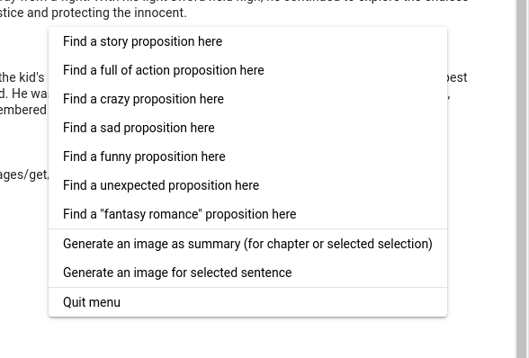
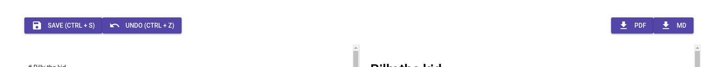

# AI story completion with different setups

  

Select a text, and then right-click and select one of the propositions. Wait a moment and bang! A the end of selection it would generate completion.

# AI story completion in-place

Same as story completion, but in place - move your cursor when you want to complete story. 

Right-click and select completion! It would generate completion from text before and AFTER your cursor.

# Image generation for selected text

Select a text, and then right-click and select Generate an image for selected sentence. Wait a moment and bang! A the end image from sentence that you selected appears.

# Image generation for summary

Select a text, and then right-click and select Generate an image as summary.

It will first try to summarize selection (generate 12 descriptive words) what happen in the text, and after that - pass to OpenAI to generare summary.

# Basic book operations

  

You can download your book in 2 formats - PDF and Markdown.

You can also save your book.

# Inspirations

I would encourage you to experiment yourself.

This tool creates a stories and saves into Inspiration book.

Write kind of story, short description (or not) and hit Create!.

If you will disable full auto, then you can write in field "Story about what" everything, and AI will try to proceed!

We all feels blocked sometimes!

# Time Travel 

By using [immudb](https://immudb.io) all of your creations are safe, immutable and tamperproof.

Because of that it's very easy to undo and redo content of the book.

Even if you accidentialy hit save on empty book - you can always back.

# Immutability

Becasue of immudb your creations are always safe and immutable. That means, that it could only change, but you can't really loss data in logical way.

The only way to lose your creations is to manually delete entire database, or physical drive break.
